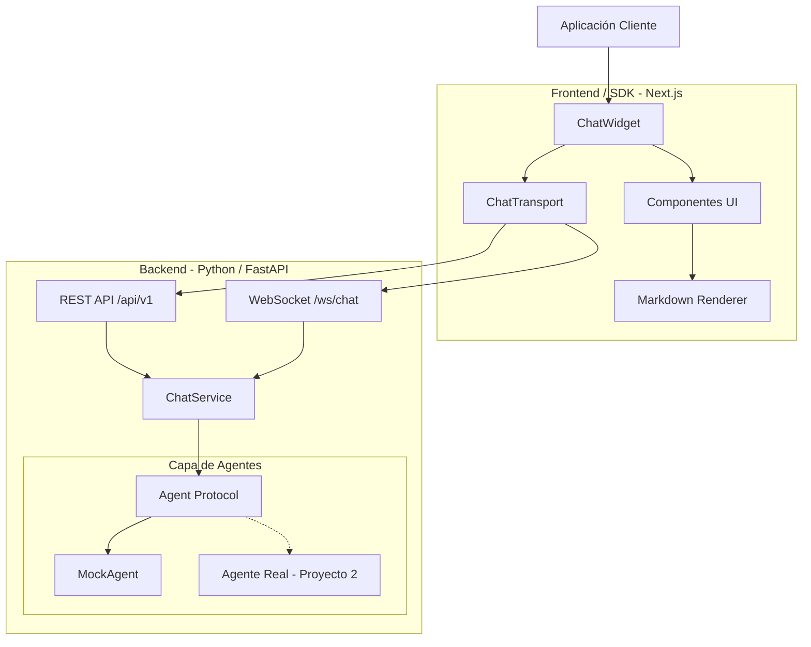
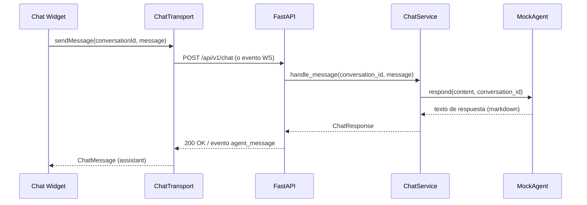

# Arquitectura — AGIChat SDK

## 1. Objetivos arquitectónicos

- Separar completamente la interfaz visual del mecanismo de comunicación y de la implementación del agente.
- Permitir sustituir `MockAgent` por un agente real (Proyecto 2) sin tocar el widget.
- Mantener el widget distribuible como paquete independiente (`@agichat/chat-widget`).
- Priorizar pruebas automatizadas y feedback rápido (hot reload en frontend y backend).

## 2. Diagrama



## 3. Justificación

`ChatWidget` nunca importa `fetch` ni `WebSocket` directamente: solo conoce la interfaz `ChatTransport`. Esto permite:

- Testear el widget con un transport falso (sin red).
- Cambiar de HTTP a WebSocket (o agregar SSE) sin tocar componentes visuales.
- Reutilizar el mismo widget en cualquier aplicación host que provea un transport válido.

En el backend, `ChatService` depende del `Protocol Agent`, no de `MockAgent`. Esto es lo que permite que Proyecto 2 conecte un agente real (LLM + tools + memoria) sin reescribir rutas ni el servicio.

## 4. Responsabilidad de cada capa

| Capa | Responsabilidad |
|---|---|
| `ChatWidget` | Orquesta header, historial, composer y estado de la conversación (`useChat`) |
| Componentes UI | Renderizado puro, sin lógica de red |
| `MarkdownRenderer` | Sanitiza y renderiza Markdown del agente (nunca `dangerouslySetInnerHTML`) |
| `ChatTransport` | Contrato único de comunicación; implementaciones HTTP y WebSocket |
| API REST (`/api/v1`) | Endpoints versionados, valida con Pydantic |
| WebSocket (`/ws/chat`) | Protocolo de eventos (`agent_start` / `agent_message` / `agent_end` / `error`) |
| `ChatService` | Caso de uso: recibe un mensaje, lo pasa al agente, arma la respuesta |
| `Agent` (Protocol) | Contrato que cualquier agente (mock o real) debe cumplir |

## 5. Flujo de un mensaje



## 6. Estructura de folders

```text
apps/web/                 App Next.js de demostración
  app/                    App Router (layout, page, estilos globales)
  components/             Wiring de la demo (ChatDemo) — no lógica reutilizable
  lib/                    Configuración de transport para la demo

apps/api/
  app/api/routes/         Endpoints (health, chat, websocket)
  app/agents/              Protocol Agent + MockAgent
  app/core/                Configuración (variables de entorno)
  app/schemas/             Contratos Pydantic
  app/services/            Casos de uso (ChatService)
  tests/                   pytest, un archivo por unidad testeada

packages/chat-widget/
  src/components/          Componentes visuales del widget
  src/hooks/               useChat (estado de la conversación)
  src/transport/           ChatTransport + implementaciones HTTP/WebSocket
  src/types/               Contratos TypeScript compartidos
  tests/                   Vitest + Testing Library
```

## 7. Cómo agregar un nuevo componente

1. Crear el componente en `packages/chat-widget/src/components/`, recibiendo props explícitas (sin leer configuración global).
2. Escribir el test primero en `packages/chat-widget/tests/`.
3. Exportarlo desde `src/index.ts` solo si debe ser parte de la API pública del SDK.

## 8. Cómo agregar un nuevo transport

1. Implementar la interfaz `ChatTransport` (`sendMessage(conversationId, message): Promise<ChatMessage>`) en `src/transport/`.
2. Escribir tests inyectando un doble de la dependencia real (`fetch`, `WebSocket`, SDK de terceros) — nunca golpear la red en tests.
3. No modificar `ChatWidget` ni `useChat`: reciben el transport por props/opciones.

## 9. Cómo agregar un agente real

1. Implementar el `Protocol Agent` (`app/agents/base.py`) en un nuevo módulo, p. ej. `app/agents/openai_agent.py`.
2. Inyectarlo en `app/api/deps.py::get_chat_service`, reemplazando (o seleccionando por configuración) `MockAgent`.
3. No modificar `ChatService`, las rutas REST/WebSocket, ni el frontend.

## 10. Decisiones y trade-offs

- **Monorepo con npm workspaces** en vez de paquetes publicados: simplifica el desarrollo local y el hot reload entre `apps/web` y `packages/chat-widget` sin necesidad de publicar versiones intermedias.
- **WebSocket con protocolo de eventos simple** (`agent_start`/`agent_message`/`agent_end`/`error`) en vez de streaming token a token: suficiente para Proyecto 1 (mock) y compatible con streaming real más adelante sin romper el contrato del lado del cliente.
- **rehype-sanitize sin rehype-raw**: el HTML crudo embebido en Markdown no se renderiza en absoluto (se escapa), lo cual es más seguro que sanitizar HTML permitido — a costa de no soportar HTML crudo en las respuestas del agente (no es un requisito).
- **Un solo mensaje en vuelo por conversación**: `useChat` deshabilita el composer mientras espera respuesta. Simplifica el estado y evita mezclar respuestas fuera de orden; suficiente para Proyecto 1.
